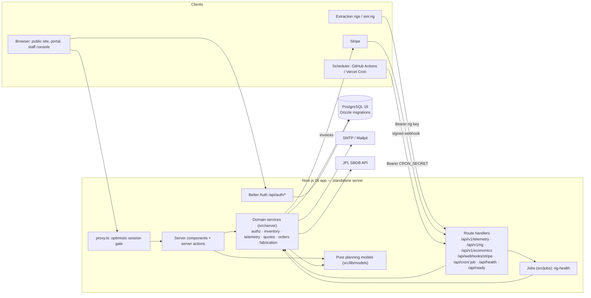

# Orbital Quarry — Space Material Mining platform

> A company that extracts basic materials like silicon and titanium in space to build things there.

Software can't build the mining hardware, so this repository is the company's **operating platform**:
prospecting and mission economics, extraction-rig telemetry, a material inventory ledger across space
depots, in-space fabrication, and a B2B customer portal for buying in-space materials and components.
"Orbital Quarry" is a working name, configurable via `NEXT_PUBLIC_APP_NAME`.

> **Honesty note.** All physics and economics in this product are **first-order planning models**, not
> flight-grade analysis. Composition values are **nominal planning values** that must be replaced by
> survey data. Seeded asteroid orbital elements are **approximate — refresh from JPL SBDB**. See
> [`/about`](<src/app/(public)/about/page.tsx>) in the app and [docs/ARCHITECTURE.md](docs/ARCHITECTURE.md#planning-models).

## Features

| Area                                   | What it does                                                                                                                                                                                                                                                                                                                                                                                                                                                |
| -------------------------------------- | ----------------------------------------------------------------------------------------------------------------------------------------------------------------------------------------------------------------------------------------------------------------------------------------------------------------------------------------------------------------------------------------------------------------------------------------------------------- |
| **Target catalog**                     | 4 lunar sites (high-Ti mare, low-Ti mare, highland, south-polar rim) and 8 real NEAs (Ryugu, Bennu, Itokawa, Nereus, Didymos, 1989 ML, 1996 FG3, 2000 SG344) with approximate a/e/i and spectral class. **JPL SBDB importer** (`sbdb.api?sstr=…`) maps elements, H, diameter and spectral class into a target.                                                                                                                                              |
| **Planning models** (`src/lib/models`) | Patched-conic NEA Δv (Hohmann to aphelion/perihelion, Oberth departure from 400 km LEO, law-of-cosines plane change) + cis-lunar node map (LEO, GEO, EML1, LLO, lunar surface); composition (wt% with ranges; ilmenite-hosted Ti); processes (MRE, H₂ ilmenite reduction, magnetic separation, volatiles extraction); rocket equation; mission economics (capex, opex, transport, NPV, breakeven, Earth-launch comparison); quote pricing. 100+ unit tests. |
| **Mission planning** (engineer)        | Create scenarios → computed results saved as **immutable snapshots** stamped with the model version (DB trigger enforced); compare side by side; publish a scenario as the pricing cost basis. Interactive **economics explorer** validated server-side.                                                                                                                                                                                                    |
| **Operations** (operator)              | Missions and extraction rigs; **per-rig API keys** (random, shown once, SHA-256 stored, revocable); `POST /api/v1/telemetry` (Bearer key, Zod-validated batches, idempotent on (rig, seq), rate-limited) credits output to the rig's depot ledger; `npm run sim:rig` simulator; **rig-health job** (silent / out-of-range alerts, emailed once).                                                                                                            |
| **Inventory ledger**                   | Depots, append-only ledger (production, transfers, fabrication consumption/output, delivery, adjustment with reason), balances computed from the ledger, **never negative** (row-locked `SELECT … FOR UPDATE` + CHECK constraints), reservations, depot-to-depot transfers recording Δv, propellant and cost.                                                                                                                                               |
| **Fabrication**                        | Product catalog with bills of materials; jobs `queued → in_progress → completed / failed` that **atomically** consume inputs and produce finished goods.                                                                                                                                                                                                                                                                                                    |
| **Customer portal**                    | Public catalog with indicative prices, request-for-quote, engineer review/issue with server-side pricing engine and validity date, accept → order → **Stripe Invoicing** reservation deposit (default 10%) → `invoice.paid` webhook (idempotent) → confirmed → operators reserve and fulfil (delivery ledger entry). Customers only ever see their own records.                                                                                             |
| **Dashboards**                         | Mission control (active rigs, production-rate chart, inventory by depot & material, open alerts), economics explorer, customer dashboard.                                                                                                                                                                                                                                                                                                                   |
| **Platform**                           | Better Auth (email/password, roles `customer` / `engineer` / `operator` / `admin`), Postgres-backed rate limiting, audit log, security headers, health/readiness probes, pino JSON logs, Docker image, CI/CD.                                                                                                                                                                                                                                               |

## Architecture



More detail: [docs/ARCHITECTURE.md](docs/ARCHITECTURE.md).

## Quickstart

Requirements: Node 22 (`.nvmrc`), npm 10, Docker (for Postgres + Mailpit) or a local PostgreSQL 16.

```bash
cp .env.example .env            # then set BETTER_AUTH_SECRET and CRON_SECRET (openssl rand -hex 32)
docker compose up -d db mailpit # Postgres on 5432 (dev + test DBs), Mailpit SMTP 1026 / UI 8026
npm ci
npm run db:migrate
npm run db:seed                 # prints demo credentials and a simulator rig key
npm run dev                     # http://localhost:3002
```

Demo accounts (password `orbital-demo-2026`, override with `SEED_DEMO_PASSWORD`):

| Role     | Email                          |
| -------- | ------------------------------ |
| admin    | `admin@orbital-quarry.test`    |
| engineer | `engineer@orbital-quarry.test` |
| operator | `operator@orbital-quarry.test` |
| customer | `buyer@helios-arrays.test`     |
| customer | `buyer@lagrange-habitats.test` |

Stream simulated telemetry into the running app: `RIG_API_KEY=<key from seed> npm run sim:rig`
(or `npm run sim:rig -- --register` to create a fresh dev rig). With `PAYMENTS_MODE=test-bypass` (dev
only), a customer can click **Simulate deposit payment** on an order to exercise the webhook path.

## Scripts

| Script                                                     | Purpose                                                                                                |
| ---------------------------------------------------------- | ------------------------------------------------------------------------------------------------------ |
| `npm run dev`                                              | Next.js dev server on port 3002                                                                        |
| `npm run build` / `npm start`                              | Production build / serve on port 3002                                                                  |
| `npm run lint` / `npm run format` / `npm run format:check` | ESLint 9 (next + typescript-eslint) / Prettier                                                         |
| `npm run typecheck`                                        | `tsc --noEmit`                                                                                         |
| `npm test`                                                 | Vitest: unit (`src/**/*.test.ts`) + integration (`tests/integration`, real test DB)                    |
| `npm run test:unit` / `npm run test:integration`           | Run one Vitest project                                                                                 |
| `npm run test:e2e`                                         | Playwright against `next start` on :3002 with a freshly seeded test DB (run `npm run build` first)     |
| `npm run db:generate`                                      | Generate a SQL migration from `src/db/schema.ts` (commit it)                                           |
| `npm run db:migrate`                                       | Apply migrations in `drizzle/`                                                                         |
| `npm run db:seed`                                          | Seed reference + demo data (`-- --reset` truncates first; refused in production)                       |
| `npm run db:studio`                                        | Drizzle Studio                                                                                         |
| `npm run build:migrator`                                   | Bundle `scripts/migrate.ts` → `dist/migrate.mjs` (used by the Docker image)                            |
| `npm run sim:rig`                                          | Rig telemetry simulator (`--url`, `--interval`, `--count`, `--batch`, `--anomaly-every`, `--register`) |
| `npm run job:rig-health`                                   | Run the rig-health alerts job once                                                                     |

## Environment variables

All variables are validated by [`src/env.ts`](src/env.ts); `.env.example` documents each one.

| Variable                                                                                              | Required     | Default                 | Purpose                                                 |
| ----------------------------------------------------------------------------------------------------- | ------------ | ----------------------- | ------------------------------------------------------- |
| `DATABASE_URL`                                                                                        | yes          | —                       | PostgreSQL connection string                            |
| `DATABASE_POOL_MAX`                                                                                   | no           | `10`                    | Pool size per instance                                  |
| `APP_URL`                                                                                             | no           | `http://localhost:3002` | Public base URL (emails, auth)                          |
| `NEXT_PUBLIC_APP_NAME`                                                                                | no           | `Orbital Quarry`        | Product name (build-time)                               |
| `BETTER_AUTH_SECRET`                                                                                  | yes          | —                       | ≥ 32 chars session/crypto secret                        |
| `BETTER_AUTH_URL`                                                                                     | no           | `APP_URL`               | Auth base URL                                           |
| `CRON_SECRET`                                                                                         | yes          | —                       | Bearer token for `/api/cron/*`                          |
| `TRUST_PROXY`                                                                                         | no           | `false`                 | Trust `X-Forwarded-For` for rate-limit keys             |
| `LOG_LEVEL`                                                                                           | no           | `info`                  | pino level                                              |
| `PAYMENTS_MODE`                                                                                       | no           | `stripe`                | `stripe` or `test-bypass` (never allowed in production) |
| `STRIPE_SECRET_KEY`                                                                                   | for payments | —                       | Stripe API key                                          |
| `STRIPE_WEBHOOK_SECRET`                                                                               | for payments | —                       | Webhook signing secret                                  |
| `STRIPE_CURRENCY` / `INVOICE_DAYS_UNTIL_DUE`                                                          | no           | `usd` / `14`            | Invoice settings                                        |
| `SMTP_HOST` `SMTP_PORT` `SMTP_SECURE` `SMTP_USER` `SMTP_PASSWORD` `EMAIL_FROM`                        | no           | log-only                | Email delivery                                          |
| `OPS_ALERT_EMAILS`                                                                                    | no           | —                       | Extra alert recipients                                  |
| `QUOTE_MARGIN_PERCENT` / `QUOTE_VALIDITY_DAYS` / `DEPOSIT_PERCENT`                                    | no           | `25` / `30` / `10`      | Commercial defaults                                     |
| `IN_SPACE_PROPELLANT_COST_PER_KG_CENTS`                                                               | no           | `100000`                | Transport cost basis ($1,000/kg)                        |
| `FABRICATION_ENERGY_COST_PER_KWH_CENTS`                                                               | no           | `200`                   | Fabrication energy price                                |
| `LAUNCH_COST_PER_KG_CENTS`                                                                            | no           | `250000`                | Earth→LEO price for the landing comparison              |
| `RIG_SILENT_MINUTES`                                                                                  | no           | `15`                    | Silence threshold for alerts                            |
| `TELEMETRY_RATE_LIMIT_PER_MINUTE` / `AUTH_RATE_LIMIT_PER_MINUTE` / `PUBLIC_WRITE_RATE_LIMIT_PER_HOUR` | no           | `120` / `10` / `20`     | Rate limits                                             |
| `SKIP_ENV_VALIDATION`                                                                                 | build only   | —                       | `next build` without secrets; ignored at runtime        |
| `TEST_DATABASE_URL` / `E2E_DATABASE_URL`                                                              | tests        | `…/space_mining_test`   | Wiped by the test suites                                |

## Testing

- **Unit** — every planning model (Δv sanity bounds, monotonic in inclination, Earth-like orbit, symmetry,
  rocket-equation round trips, composition invariants, yields, NPV/breakeven, pricing and integer-money
  rounding), the SBDB mapper with a mocked `fetch`, telemetry schema, env validation, API keys.
- **Integration** (real Postgres, migrated in global setup, truncated between tests) — telemetry auth,
  idempotency and ledger credit; concurrent withdrawals never going negative; deadlock-free opposing
  transfers; fabrication atomicity and state machine; quote → accept → invoice → signed webhook →
  confirmed (and duplicate-event handling); reservations and fulfilment; role enforcement and
  customer-A-vs-customer-B isolation over HTTP with real sessions; rig-health idempotency; immutable
  snapshots and the append-only ledger trigger.
- **E2E** (Playwright, production build) — engineer creates a scenario and sees Δv/yield/cost; a new
  customer signs up and requests a quote; public pages and probes.

## Deployment (summary)

The app ships as one container (`Dockerfile`, standalone output, non-root, `HEALTHCHECK`) plus a
bundled migration runner (`docker run <image> node migrate.mjs`). It runs on any container host
(Render, Fly.io, Railway, ECS, Kubernetes) or on Vercel with managed Postgres (e.g. Neon). After CI
succeeds on `main`, the `deploy.yml` workflow pushes `ghcr.io/<owner>/<repo>:{sha,latest}` for the
tested commit, applies migrations with `PRODUCTION_DATABASE_URL` and calls `DEPLOY_HOOK_URL`. Schedule `POST /api/cron/rig-health`
every 5–10 minutes. Full guide: [docs/DEPLOYMENT.md](docs/DEPLOYMENT.md).

## Documentation

- [docs/ARCHITECTURE.md](docs/ARCHITECTURE.md) — components, data model, planning models, security design
- [docs/DEPLOYMENT.md](docs/DEPLOYMENT.md) — containers, Vercel + Neon, migrations, Stripe, cron, backups
- [docs/RUNBOOK.md](docs/RUNBOOK.md) — on-call procedures
- [docs/LAUNCH_CHECKLIST.md](docs/LAUNCH_CHECKLIST.md) — non-code work before real customers
- [SECURITY.md](SECURITY.md) · [CONTRIBUTING.md](CONTRIBUTING.md) · [LICENSE](LICENSE)

## Version pins

TypeScript is pinned to `~5.9.3` (TypeScript 7 is the Go port and breaks Next.js/typescript-eslint),
ESLint to 9.x (plugin compatibility), and `@playwright/test` to `~1.56.0` (matches the preinstalled
Chromium build locally; CI installs its own browser).
